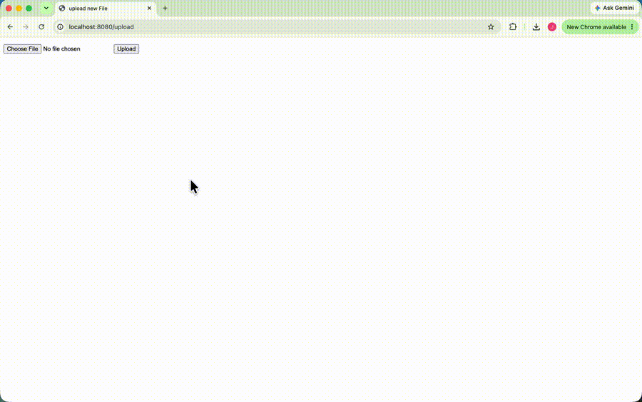

# flask-on-docker


This repo contains a small Flask web app deployed on a production-style stack modeled on Instagram's architecture: Nginx as the reverse proxy that also serves static and media files, Flask + Gunicorn as the web framework and application server, and PostgreSQL as the database. Every service runs in its own Docker container, coordinated with Docker Compose, and the project has separate development (Flask dev server with live reload) and production (Gunicorn behind Nginx, multi-stage image, non-root user) configurations. The app itself is intentionally minimal. The point was to assemble a stack I can reuse for larger projects. It can upload an image and serve it back.



## Build Instructions

After cloning the repo, create three `.env` files in the project root. They are listed in `.gitignore` and are never committed.

`.env.prod.db` holds the database credentials:

```
POSTGRES_USER={your username}
POSTGRES_PASSWORD={your password}
POSTGRES_DB={your db name}
```

`.env.prod`:

```
FLASK_APP=project/__init__.py
FLASK_DEBUG=0
DATABASE_URL=postgresql://{your username}:{your password}@db:5432/{your db name}
SQL_HOST=db
SQL_PORT=5432
DATABASE=postgres
APP_FOLDER=/home/app/web
```

`.env.dev`:

```
FLASK_APP=project/__init__.py
FLASK_DEBUG=1
DATABASE_URL=postgresql://hello_flask:hello_flask@db:5432/hello_flask_dev
SQL_HOST=db
SQL_PORT=5432
DATABASE=postgres
APP_FOLDER=/usr/src/app
```

The dev database credentials must match the `db` service in `docker-compose.yml`.

### Production

```
$ docker compose -f docker-compose.prod.yml up -d --build
$ docker compose -f docker-compose.prod.yml exec web python manage.py create_db
```

### Development

```
$ docker compose up -d --build
$ docker compose exec web python manage.py seed_db
```

### Using the app

The app runs at `http://localhost:1147`.

- `/` returns `{"hello": "world"}`
- `/upload` shows a form for uploading a file
- `/media/<filename>` shows an uploaded file

To shut the containers down and delete the volumes, run:

```
$ docker compose down -v
```

Add `-f docker-compose.prod.yml` to shut down the production stack.
